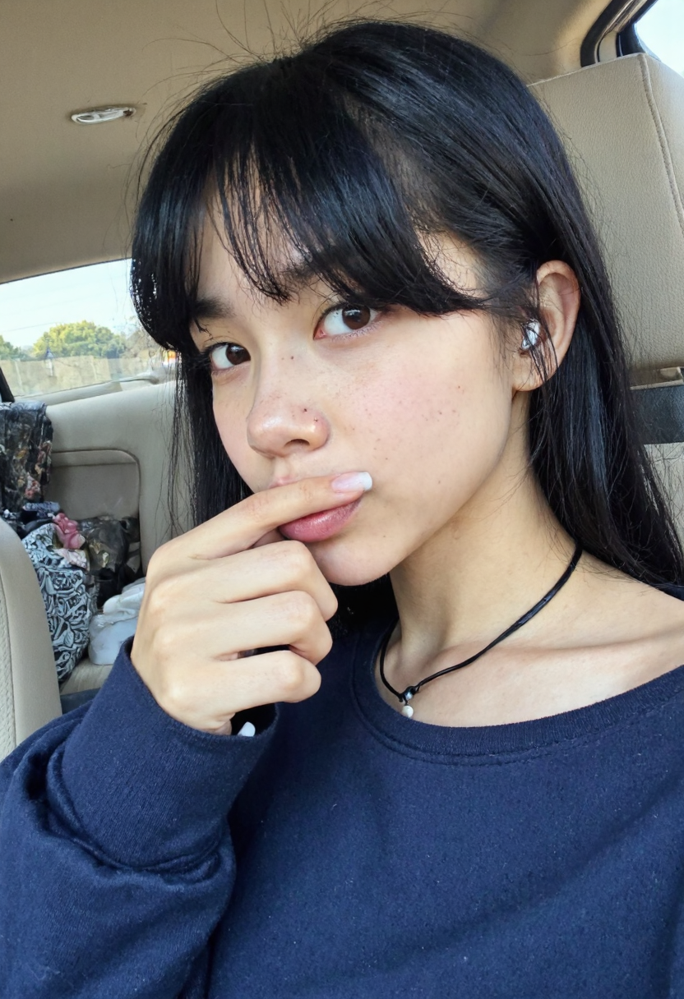
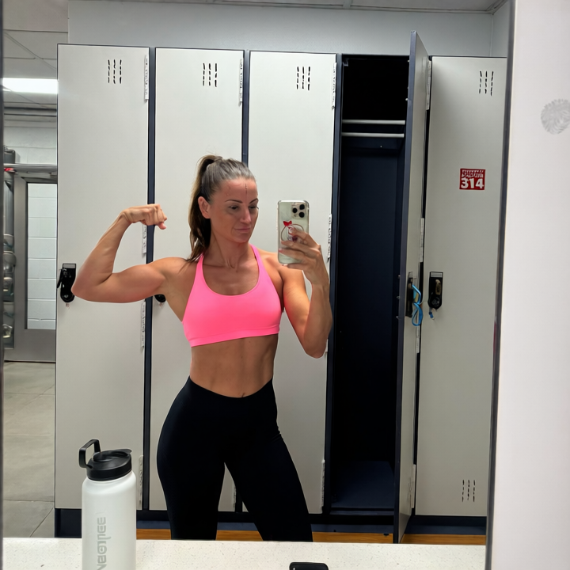
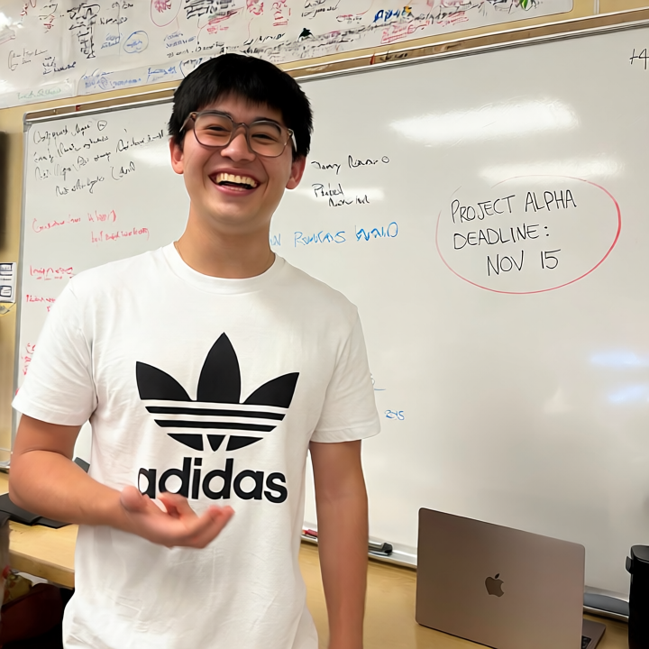
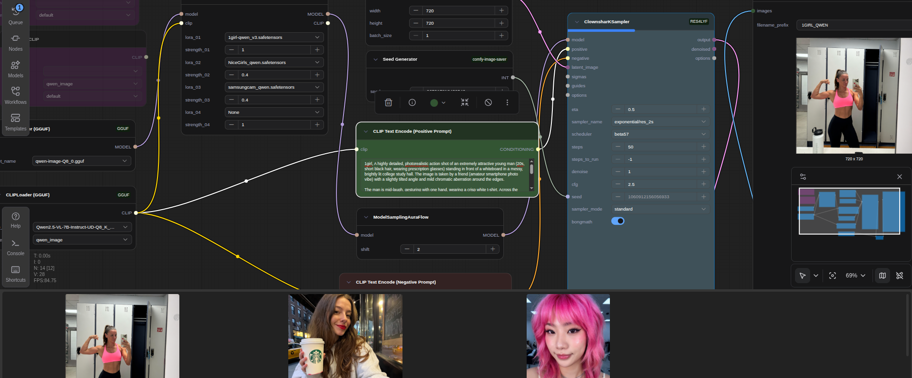

# ComfyUI Portfolio
This file contains example generations by me using multiple models and workflow in comfyui.

## Flux.1 Dev

Flux models generate high-quality photorealistic images. amatuer vibe loras.

### Examples

  

  

### Models & LoRAs Used

- Flux (flux.1-dev finetuned gguf)
- Samsung_ultracam

---

## Qwen Image edit

Qwen models provide powerful image generation including accurate text and logos, studio quality and dynamic world and prompt understanding.

### Examples

   

### Models & LoRAs Used

- Qwen2-VL
- Qwen image edit
- 1girl lora
- samsung ultrareal lora

### Workflow Screenshot

---

## Wan infinite talk Video

Wan enables smooth video generation with image and text and a wide range of styles and animation controls.

### Examples

[📹 Watch Video](product_ugc.mp4)

*Click the link above to download and view the video*

### Models & LoRAs Used

- Wan2.2
- Infinite talk with wan wrapper
- vibe voice 
- Qwen

